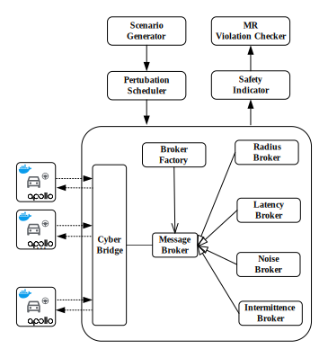

# Badges Application

The authors are applying for the following badges:

1. **Artifact Available**
2. **Artifact Functional**
3. **Artifact Reusable**

We believe our artifact qualifies for these badges based on the following evidence:

---

### Artifact Availability

- **Opensource Commitment:**  
  The artifact is open-sourced during the review process and will be publicly released on GitHub upon paper acceptance, allowing the community to freely download, inspect, and reuse the implementation. This project is licensed under the GNU General Public License v3.0 (GPL-3.0) .

---

### Functional Validity

- **Multi-Machine Validation:**  
  The artifact has been successfully tested on **four different machines**, completing the full project workflow without errors.

- **Code Documentation & Engineering Quality:**  
  The codebase includes **comprehensive documentation and inline comments**. We have restructured the underlying implementation based on the **DoppelTest framework** [[1](#ref1)], fixing known issues and improving support for multi-vehicle interaction scenarios.

  Notably, we extended the runtime execution model from the original: `Generation -> Scenario` to our version `Generation -> Scenario -> Follow`. This enables **follow-up test case execution** in perturbated V2V settings in those imperfect inter-perception conditions mentioned in the main paper.

---

### Reusable Possibility

- **Inheritance relations**  
We follow object-oriented methodology. We carefully designed the [MessageBroker](broker/__init__.py) class along with four subclasses (i.e. [RadiusBroker](broker/radius.py), [LatencyBroker](broker/latency.py), [NoiseBroker](broker/noise.py) and [IntermittenceBroker](broker/intermittence.py)) inheritance structures, leveraging function overloading to support imperfect inter-perception simulation among connected vehicles.

- **Factory method**  
By using the factory pattern in [BrokerFactory](broker/factory.py) class, the system can dynamically assign different broker strategies at runtime, allowing greater extensibility and flexibility for future research with other customized V2V information sharing mechanisms beside those introduced in the main paper.

The implementation relationships in our framework are illustrated as follows.

  

In addition, the [safety indicator](scenario/detect.py) component (e.g., minimum distance checks) has been **decoupled** from the [MBK](broker/__init__.py) runtime, enabling **independent** test case safety analysis. This component is designed with extensibility in mind, and can be further developed into an online monitor based on Signal Temporal Logic (STL) [[2](#ref2)]. We are currently planning to evolve it into an online monitor [[3](#ref3)] to support more advanced safety and causality reasoning during runtime.

---

We welcome your feedback and hope the artifact proves useful for reproduction and future development.

## Acknowledgement

Our framework builds upon the reusable artifact of **DoppelTest** [[1](#ref1)], originally published in ICSE 2023.

> Declaration: The authors of this paper have no overlap with the DoppelTest teams and declare no conflict of interest. We strictly follow the double-blind review mechanism.

Q: Why didn’t we separate DoppelTest and our own work by placing the original source code in a standalone folder?

A: The reason is that we extensively modified its dependencies, class attributes, and functions, fixed a number of bugs.

For an example, we refactored the [traffic signal control](scenario/traffic_light.py) module to support cyclic signal transitions `green → yellow → red` loops.

In contrast, the original DoppelTest implementation could only perform one-off signal changes (e.g., `green → yellow → red` or `red → green`). Our mutually exclusive cyclic signaling algorithm allows for the exploration of longer scenarios and supports more complex and extended maps.

Additionally, we added several utility functions that may be useful in future extensions. Since these modifications were made directly within the DoppelTest codebase, it became difficult to decouple the two. Therefore, we opted to restructure the codebase accordingly.

## Call for LHT support

During our experiments, we followed the default right-hand traffic (RHT) configuration of the system under test. However, we observed that the current open-source version of Baidu Apollo lacks support for left-hand traffic (LHT) and right-hand drive (RHD) configurations. In response, we propose this as a potential improvement area and encourage the open-source community to consider addressing it, in order to facilitate autonomous driving research in LHT countries. Details: [call_for_LHT_support.MD](call_for_LHT_support.MD)

## References

<a name="ref1">[1]</a> Yuqi Huai, Yuntianyi Chen, Sumaya Almanee, Tuan Ngo, Xiang Liao, Ziwen Wan, Qi Alfred Chen, and Joshua Garcia. 2023. Doppelgänger Test Generation for Revealing Bugs in Autonomous Driving Software. In Proceedings of the 45th International Conference on Software Engineering (ICSE ’23). IEEE/ACM, Melbourne, Australia, 2591–2603. https://doi.org/10.1109/ICSE48619.2023.00216

<a name="ref2">[2]</a> Oded Maler and Dejan Nickovic. 2004. Monitoring temporal properties of continuous signals. In *Formal Techniques, Modelling and Analysis of Timed and Fault-Tolerant Systems (FORMATS 2004)*, pages 152–166. Springer.

<a name="ref3">[3]</a> Peter Du, Zhe Huang, Tianqi Liu, Tianchen Ji, Ke Xu, Qichao Gao, Hussein Sibai, Katherine Driggs-Campbell, and Sayan Mitra. 2020. Online monitoring for safe pedestrian-vehicle interactions. In *Proceedings of the 2020 IEEE 23rd International Conference on Intelligent Transportation Systems (ITSC)*, Rhodes, Greece, pages 1–8. IEEE. https://doi.org/10.1109/ITSC45102.2020.9294366