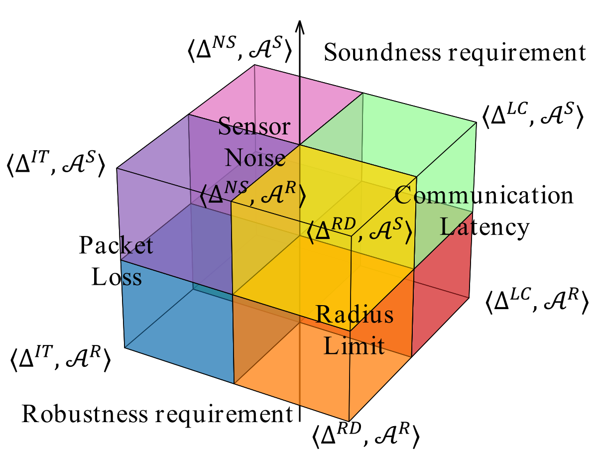

# Features

## Implement 4 types of transformation

| Perturbation | Notation | Description |
|:------------:|:--------:|-------------|
| Radius limit | $\Delta^{RD}$ | Truncates shared perception beyond a given communication range to simulate limited V2V range. |
| Latency | $\Delta^{LC}$ | Latency the reception of shared information, emulating network-induced latency or transmission lags. |
| Gaussian noise | $\Delta^{NS}$ | Injects Gaussian noise into shared positions, reflecting sensor inaccuracies or fusion errors. |
| Packet loss | $\Delta^{IT}$ | Randomly drops messages based on a probability model, simulating unstable or lossy wireless communication. |

## Establish 2 categories of creteria

| Oracle | Notation | Description |
|:------:|:--------:|-------------|
| Soundness| $\mathcal{A}^{S}$ | Assert that the performance of ADSs under perfect perception should not be worse than under degraded communication condition.|
| Robustness | $\mathcal{A}^{R}$ | Assert that behaviours of ADSs should not decline significantly under minor disruption. |

## Combine transformation with creteria

Each perturbation simulates a specific type of distortion in
shared information, while each oracle determines whether the
system’s behaviour remains logically consistent or sufficiently
resilient. We construct eight metamorphic relations (MRs) by pairing four types of mutual-perception perturbations with two behavioral evaluation dimensions. The resulting exploration space is illustrated in the following figure.

  

