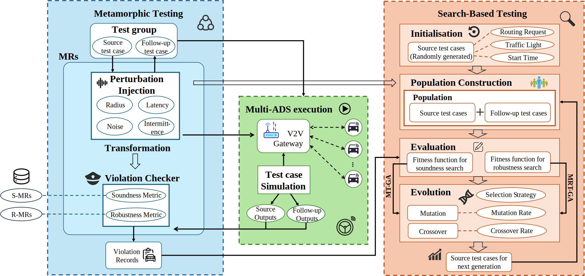

# Meta²V2V

## Overview

*Meta²V2V* is a **metamorphic** testing framework designed to evaluate the decision-making quanlity of Autonomous Driving Systems (ADS) in multi-agent scenarios with vehicle-to-vehicle (V2V)
communication. It systematically explores the effects of degraded inter-vehicle perception on ADS
behavior by injecting controlled perturbations into information sharing mechanisms by modifying
the **meta-data**.

<div align="center">
  
</div>

This repository enables the evaluation of **decision soundness** and **planning robustness** in autonomous 
driving systems (ADS) under four typical V2V perception anomalies: **radius limitation**, **transmission
 latency**, **sensor noise**, and **packet loss**. It automatically generates follow-up test cases from given
  source test cases, and employs a search-based approach to identify both soundness and robustness violations of metamorphic 
  relations (MRs) between them in parallel.

## Features

The workflow of *Meta²V2V* is shown below. Further details on the eight metamorphic relations (MRs), derived from four perturbation types and two evaluation dimensions, can be found in [FEATURES.MD](FEATURES.MD).

<div align="center">
  
</div>

Design details are provided in [ARTIFACT.MD](ARTIFACT.MD).

The structure of the code repository is documented in [TREE.MD](TREE.MD).

## Hardware Requirements

- Intel Core i9 12900K (16-core) and above

> [Warning] If you’re using an Intel Core i9 13th or 14th generation processor with a K suffix, you may encounter a segmentation fault during prolonged runs. More details, please refer: [Intel Core 13th and 14th Gen Desktop Instability Root Cause](https://community.intel.com/t5/Blogs/Tech-Innovation/Client/Intel-Core-13th-and-14th-Gen-Desktop-Instability-Root-Cause/post/1633239).

- 64 GB memory and above

- NVIDIA RTX 3090 and above **(Optional)**

## QuickStart

> For more detailed installation instructions, please refer to [INSTALL.MD](INSTALL.MD).

### Software Prerequisites

- Ubuntu 18.04 or later

- Python 3.12

- NVIDIA driver version 455.32.00 or later (Optional)

### Install *Meta²V2V*

```bash
pip install -r requirements.txt
```
> [Tips] A good practice is to use environment management tools such as [Anaconda](https://www.anaconda.com/) to isolate the Python environment for the project.

> If you run into issues when installing Shapely library, please first run `sudo apt-get install libgeos-dev` to install its dependencies.

### Install Baidu Apollo

To simplify the installation process, we provide an automatic script [install_apollo.py](install_apollo.py). The user just need to run this script on a clean Ubuntu system to automatically download and install the specific version of Baidu Apollo we use.

```bash
python install_apollo.py
```

> If you encounter any issues with the automated script above, please report them to the authors as soon as possible so we can fix the bugs in the installation script. You can also resolve them by following the manual installation method in [INSTALL.MD](INSTALL.MD).

### Run the main scripts

1. Start the soundness violation–driven Metamorphic Testing (MT) (search-based) via:
   
```bash
python main_soundness_ga.py
```

2. Start the robustness violation–driven Metamorphic Robustness Testing (MRT) (search-based) via:

```bash
python main_robustness_ga.py
```

3. Start the random baseline of soundness and robustness violation via:

```bash
python main_follow_random.py
```

4. Using the [from_json](from_json.py) script, you can specify a `scenario.json` and a `communication.json` to reproduce the runtime of a given chromosome.

```bash
python from_json.py
```

5. You can use the [replay](replay.py) script to loop any record file infinitely, providing a convenient way to observe the runtime behavior of a scenario from the perspective of a single ADS.

```bash
python replay.py
```

## Acknowledgement

Our framework builds upon the reusable artifact of **DoppelTest** [[1](#ref1)], originally published in ICSE 2023.

> Declaration: The authors of this paper have no overlap with the DoppelTest teams and declare no conflict of interest. We strictly follow the double-blind review mechanism.