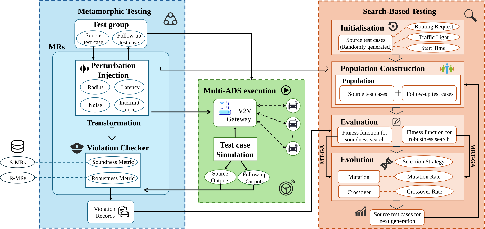

# META²V2V

## Overview

META²V2V is a **METAmorphic** framework designed to evaluate the decision-making quality of Autonomous Driving Systems (ADS) in multi-agent scenarios with vehicle-to-vehicle (V2V)
communication. It systematically explores the effects of degraded inter-vehicle perception on ADS
behavior by injecting controlled perturbations into information sharing mechanisms by modifying
the **METAdata**. [](
https://github.com/META-V2V/META-V2V/releases
)

<div align="center">
  
</div>

This repository enables the evaluation of **decision soundness** and **planning robustness** in autonomous 
driving systems (ADS) under four typical V2V perception anomalies: **radius limitation**, **transmission
 latency**, **sensor noise**, and **packet loss**. It automatically generates follow-up test cases from given
  source test cases, and employs a search-based approach to identify both soundness and robustness violations of metamorphic 
  relations (MRs) between them in parallel.

## Features

The workflow of META²V2V is shown below. Further details on the eight metamorphic relations (MRs), derived from four perturbation types and two evaluation dimensions, can be found in [FEATURES.MD](./docs/FEATURES.MD).

<div align="center">
  
</div>

Design details are provided in [ARTIFACT.MD](./docs/ARTIFACT.MD). The structure of the code repository is documented in [TREE.MD](./docs/TREE.MD).

## Hardware Requirements

- Intel Core i9 12900K (16-core) and above, as well as AMD chips with comparable performance on x64 architecture, are also supported.

> **[WARNING]** If you’re using an Intel Core i9 13th or 14th generation processor with a K suffix, you may encounter a segmentation fault during prolonged runs. More details, please refer: [Intel Core 13th and 14th Gen Desktop Instability Root Cause](https://community.intel.com/t5/Blogs/Tech-Innovation/Client/Intel-Core-13th-and-14th-Gen-Desktop-Instability-Root-Cause/post/1633239).

- 64 GB memory and above

- **No GPU is required**.

## QuickStart

> For more detailed installation instructions, please refer to [INSTALL.MD](./docs/INSTALL.MD).

### Software Prerequisites

- Ubuntu 18.04 or later

- Python 3.12

### Install META²V2V

```bash
pip install -r requirements.txt
```
> [Tips] A good practice is to use environment management tools such as [Anaconda](https://www.anaconda.com/) to isolate the Python environment for the project.

> If you run into issues when installing Shapely library, please first run `sudo apt-get install libgeos-dev` to install its dependencies.

### Install Baidu Apollo

To simplify the installation process, we provide an automatic script [./utils/install_apollo.py](./utils/install_apollo.py). The user just need to run this script on a clean Ubuntu system to automatically download and install the specific version of Baidu Apollo we use.

```bash
python ./utils/install_apollo.py
```

> If you encounter any issues with the automated script above, please report them to the authors as soon as possible so we can fix the bugs in the installation script. You can also resolve them by following the manual installation method in [INSTALL.MD](./docs/INSTALL.MD).

### Run the main scripts

Running one of the following scripts will launch a specific exploration mode. We’ve designed a simple interactive interface, just follow the prompts to begin.

1. Start the soundness violation–driven Metamorphic Testing (MT) (search-based) via:
   
```bash
python main_soundness_ga.py
```

2. Start the robustness violation–driven Metamorphic Robustness Testing (MRT) (search-based) via:

```bash
python main_robustness_ga.py
```

3. Start other explorations for the main paper's comparision via:

```bash
python main_follow_random.py      # Random evolution baseline
python main_doppeltest_ga.py      # DoppelTest fitness function baseline
python main_soundness_single.py   # Soundness Single-Obj fitness
python main_soundness_tar1.py     # Soundness only target 1
python main_soundness_tar2.py     # Soundness only target 2
python main_robustness_single.py  # Robustness Single-Obj fitness
python main_robustness_tar1.py    # Robustness only target 1
python main_robustness_tar2.py    # Robustness only target 2
```

After executing the script, the experimental logs and collected data will be stored in the ```records``` directory, which correspond to the results reported in the main paper.

### Replay the runtime

We also provide two types of replay modes, with interactive prompts as well, you can even drag the file into the shell.

1. Using the [from_json](from_json.py) script, you can specify a `scenario.json` and a `communication.json` to reproduce the runtime of a given chromosome.

```bash
python from_json.py
```

2. You can use the [replay](replay.py) script to loop any record file infinitely, providing a convenient way to observe the runtime behavior of a scenario from the perspective of a single ADS.

```bash
python replay.py
```

## Virtual Machine

We also provide a VM virtual machine .ova image, which you can download from [](https://doi.org/10.5281/zenodo.15772642). Using tools like [VirtualBox](https://www.virtualbox.org/) or any OVA v2.0 compatible virtualization software, you can run the VM without setting up any environment. Simply log in, open the terminal, run the main script, and follow the interactive prompts to immediately reproduce our results. For more details, please refer to the README file in zenodo drive.

## Acknowledgement

Our framework builds upon the reusable artifact of **DoppelTest** [[1](#ref1)], originally published in ICSE 2023.

<a name="ref1">[1]</a> Yuqi Huai, Yuntianyi Chen, Sumaya Almanee, Tuan Ngo, Xiang Liao, Ziwen Wan, Qi Alfred Chen, and Joshua Garcia. 2023. Doppelgänger Test Generation for Revealing Bugs in Autonomous Driving Software. In Proceedings of the 45th International Conference on Software Engineering (ICSE ’23). IEEE/ACM, Melbourne, Australia, 2591–2603. https://doi.org/10.1109/ICSE48619.2023.00216